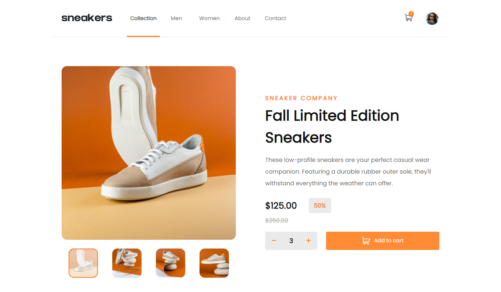

# Frontend Mentor - E-commerce product page solution

This is a solution to the [E-commerce product page challenge on Frontend Mentor](https://www.frontendmentor.io/challenges/ecommerce-product-page-UPsZ9MJp6). Frontend Mentor challenges help you improve your coding skills by building realistic projects.

## Table of contents

- [Overview](#overview)
  - [The challenge](#the-challenge)
  - [Screenshot](#screenshot)
  - [Links](#links)
- [My process](#my-process)
  - [Built with](#built-with)
  - [What I learned](#what-i-learned)
  - [Continued development](#continued-development)
- [Author](#author)
- [Acknowledgments](#acknowledgments)

## Overview

### The challenge

Users should be able to:

- View the optimal layout for the site depending on their device's screen size
- See hover states for all interactive elements on the page
- Open a lightbox gallery by clicking on the large product image
- Switch the large product image by clicking on the small thumbnail images
- Add items to the cart
- View the cart and remove items from it

### Screenshot

### Links

- Solution URL: https://github.com/nuel1/Sneakers
- Live Site URL: https://61bf8015d326b1000885449b--focused-snyder-f95f5a.netlify.app/

## My process

### Built with

- Semantic HTML5 markup
- CSS custom properties
- Flexbox
- CSS Grid
- Vanilla Javascript

### What I learned

This project is an exciting piece i built that deeply expanded my knowledge of working with the DOM. It was super exiciting
as it really gave me the feel of how larger e-commerce projects are built.

At the end of this project i learnt how to:

- Build a slider and a model.
- Build a tab( navigation ).
- Work with browser local storage.
- Add and remove cart item from user cart.

### Continued development

Working with really large images was marjorly a thing i really couldn't do. Nevertheless, i hope to tackle
this deficiency by learning and understanding how to work with images of any size.

## Author

- Frontend Mentor - https://www.frontendmentor.io/profile/nuel1

## Acknowledgments

Thanks to frontend mentor .io for this incredible project idea.
